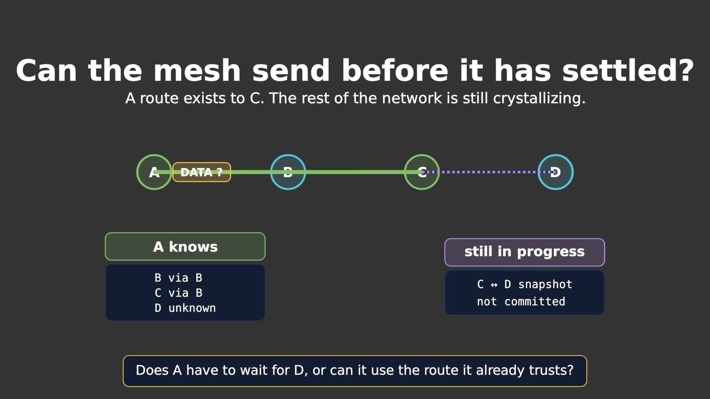

# DTProtocol

DTProtocol is a proactive multi-hop routing and message-transport library for
SX126x LoRa radios. Nodes exchange route state; application messages then follow
a selected next-hop path instead of being flooded through the network.

LCMM handles bounded per-hop retries. DTPK adds route convergence, replay
protection, optional end-to-end acknowledgement, multipart messages, selective
fragment repair, and lossless compression when compression actually reduces
LoRa airtime.

> **Wire compatibility:** this branch uses DTProtocol v4 (`library.json` version
> `4.1.0`). v3 and v4 do not interoperate. Upgrade a routing domain together.

[](docs/video/releases/DTProtocol-v4-architecture.mp4)

The animation source and reproducible ManimGL render script are in
[`docs/video/`](docs/video/README.md).

## Quick start

### PlatformIO

Use the repository directly as a library dependency:

```ini
lib_deps =
    https://github.com/mistrjirka/DTProtocol.git#protocol-v2
```

`library.json` pins RadioLib 6.6.0 for the current firmware integration.

### Initialize the radio and protocol

Create and initialize the RadioLib `SX1262` object for your board first. Then
initialize MAC and DTPK:

```cpp
#include <DTPK.h>

if (!MAC::initialize(
        radio,
        nodeId,
        MACRegion::EU868,
        0,       // channel
        9,       // spreading factor
        125.0f,  // bandwidth, kHz
        15,      // squelch margin
        13,      // conducted power, dBm
        7)) {    // coding-rate denominator
    // Radio/MAC initialization failed.
}

if (!DTPK::initialize(
        20,
        persistentBootSequence,
        isMobileDevice)) {
    // Protocol initialization failed.
}
```

`persistentBootSequence` must be nonzero and must change after every real reboot.
It is part of the replay identity, so reusing it can make a new packet look like
an old packet from a previous boot.

Exactly one owner should service the protocol loop:

```cpp
// Plain DTProtocol integration
DTPK::getInstance()->loop();

// With the supplied ESP32 BLE gateway, call only this; it services DTPK too.
Bluetooth::getInstance()->loop();
```

### Receive application data

```cpp
DTPK::getInstance()->setPacketReceivedCallback(
    [](DTPKPacketGeneric *packet, uint16_t size) {
        if (!packet || size < sizeof(DTPKPacketGeneric))
            return;

        const unsigned char *payload = packet->data;
        const size_t payloadSize = size - sizeof(DTPKPacketGeneric);

        // Consume or copy payload here. It is valid only for this callback.
    });
```

Multipart and compressed messages are reassembled and decoded before this
callback runs. The application receives the original contiguous payload once.

### Send a message

```cpp
unsigned char payload[] = "hello";

uint16_t packetId = DTPK::getInstance()->sendPacket(
    42,                         // destination node ID
    payload,
    sizeof(payload) - 1,
    60000,                      // application timeout, ms
    true,                       // request end-to-end ACK
    [](uint8_t success, uint16_t elapsedMs) {
        // success == 1 means the final destination accepted the message.
    });

if (packetId == 0) {
    // No usable route or no local admission capacity.
}
```

If no route exists yet, `sendPacket()` fails immediately with ID `0`; it does not
hide the payload in an unbounded pre-route queue.

## Routing model

DTProtocol has no global “crystallization finished” state. Route knowledge is
usable incrementally.

1. **HELLO** advertises a neighbor's boot incarnation and route-state version.
2. If that state is missing or newer, the receiver sends **CRYST_REQ**.
3. **CRYST** returns a complete neighbor route snapshot. Multi-frame snapshots
   are assembled privately and replace committed state only after every chunk is
   present.
4. Candidates are filtered by destination-generation feasibility. Among feasible
   candidates, the lowest metric wins.
5. If every known candidate is infeasible, **SEQ_REQ** asks the destination to
   originate a newer generation. Repair waves are one-shot per hop; the requester
   retries with 5–60 s exponential backoff and floods every fourth attempt.

A node may therefore send through an already selected route while unrelated
CRYST exchanges are still incomplete. Direct DATA can establish a provisional
reverse one-hop route to its immediate sender, and bounded reverse breadcrumbs
allow ACK/NACK/status traffic to return before proactive reverse routing has
fully converged.

See [Application messages during route crystallization](STARTUP_MESSAGE_DELIVERY.md)
for the detailed state transitions and failure cases.

## Reliability boundaries

| Layer | What success means |
| --- | --- |
| MAC | One radio frame was transmitted according to the channel policy. |
| LCMM | The selected next hop returned its link ACK. |
| DTPK | The final destination accepted the logical application message. |

Reliable DATA uses up to five LCMM attempts per hop. End-to-end retries reuse the
same `{source, boot incarnation, packet ID}` identity, so a destination can ACK a
replay without delivering it to the application twice.

SEQ_REQ deliberately uses a different policy: each repair wave is sent once per
hop because the requester already owns persistent logical retry. This prevents
link-level retries at every relay from multiplying repair traffic on a
half-duplex mesh.

## Payloads and memory bounds

Default capacities are intentionally finite:

| Item | Default |
| --- | ---: |
| Single-frame application payload | 233 B |
| Payload per multipart fragment | 230 B |
| Maximum logical message | 16 KiB |
| Concurrent receive assemblies | 2 |
| Locally originated pending messages | 8 |
| Replay-source slots | 256 |
| Hop limit | 255 |

Multipart transfer is transparent to the application. The destination assembles
all fragments before delivery and requests only missing fragment indices when
repair is needed. See [MULTIPART_PROTOCOL.md](MULTIPART_PROTOCOL.md).

Compression is also transparent. DTProtocol uses heatshrink only when the encoded
representation passes a local decode-and-compare check **and** reduces predicted
LoRa airtime after headers, fragment boundaries, and link ACKs are included. See
[COMPRESSION.md](COMPRESSION.md).

Applications that need assigned metadata bits can use `sendPacketWithFlags()`.
`DTPK_FLAG_DEBUG_ECHO` is currently the only application-owned bit; transport
bits cannot be forged through that API.

## Bluetooth gateway

The optional ESP32 BLE gateway exposes application messages, delivery results and
route updates over GATT. Long writes and notifications are fragmented according
to the negotiated BLE MTU rather than assuming a fixed 247-byte MTU.

Protocol details and the laptop client are in
[BLUETOOTH_PROTOCOL.md](BLUETOOTH_PROTOCOL.md):

```bash
python -m pip install bleak
python tools/dtpk_ble_client.py --name DTPK-LoraWatch --listen
```

## Test the host implementation

```bash
python -m venv .venv
.venv/bin/pip install pytest -r simulator/requirements-optimization.txt

cmake -S simulator/cpp -B simulator/cpp/build -DCMAKE_BUILD_TYPE=RelWithDebInfo
cmake --build simulator/cpp/build --parallel
ctest --test-dir simulator/cpp/build --output-on-failure

DTP_CPP_NODE="$PWD/simulator/cpp/build/dtprotocol_host_node" \
PYTHONPATH=simulator .venv/bin/python -m pytest simulator/tests -q
```

The current v4 test set includes the production C++ backend, a fast Python model,
sanitizer builds, deterministic topology/failure matrices, and bounded ILP
oracles used to investigate discovery/reliability schedules.

At revision `302ec8d` the validated protocol tree passed:

- 325/325 host tests in the normal build;
- 325/325 again under ASan/UBSan;
- 900/900 early-send/startup cases at 0%, 5%, and 10% seeded loss;
- 100/100 cut/heal topology recoveries and 100/100 post-heal message deliveries
  across 5–20 node line, ring, star and random topologies, with zero routing loops
  in that matrix.

These are bounded simulation results, not a claim about every RF environment.
The simulator does not yet model calibrated received power, capture/preamble
lock, mixed spreading factors/channels, or exact MCU task/ISR interleavings.

## Documentation

- [Protocol architecture](simulator/PROTOCOL_ARCHITECTURE.md)
- [Startup and early-message behavior](STARTUP_MESSAGE_DELIVERY.md)
- [Multipart transport](MULTIPART_PROTOCOL.md)
- [Automatic compression](COMPRESSION.md)
- [Bluetooth gateway wire format](BLUETOOTH_PROTOCOL.md)
- [Simulator validation boundary](simulator/SIMULATOR_VALIDATION.md)
- [Test coverage and remaining gaps](TEST_COVERAGE_AUDIT.md)
- [ILP optimization oracle](simulator/OPTIMIZATION_ORACLE.md)
- [Protocol-synthesis experiments](simulator/PROTOCOL_SYNTHESIS.md)
- [ManimGL explainer source and render instructions](docs/video/README.md)

## Repository status

The active v4 development branch is `protocol-v2`. The rendered architecture
video is stored with Git LFS; the Python animation source and render scripts are
ordinary files in `docs/video/`.

Maintainer: Jiří Svítil. Use the repository issue tracker for reproducible bugs or
protocol counterexamples; include topology, node IDs, firmware revision and a
minimal trace when possible.
