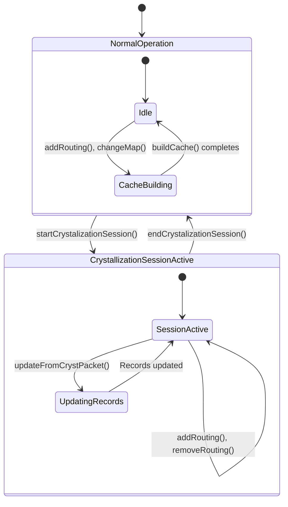

```mermaid
stateDiagram-v2
    [*] --> NormalOperation
    NormalOperation --> CrystallizationSessionActive : startCrystalizationSession()
    CrystallizationSessionActive --> NormalOperation : endCrystalizationSession()

    state NormalOperation {
        [*] --> Idle
        Idle --> CacheBuilding : addRouting(), changeMap()
        CacheBuilding --> Idle : buildCache() completes
    }

    state CrystallizationSessionActive {
        [*] --> SessionActive
        SessionActive --> UpdatingRecords : updateFromCrystPacket()
        UpdatingRecords --> SessionActive : Records updated
        SessionActive --> SessionActive : addRouting(), removeRouting()
    }

```