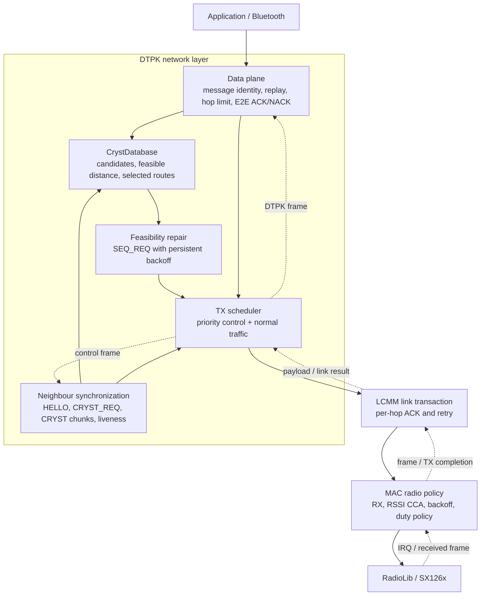
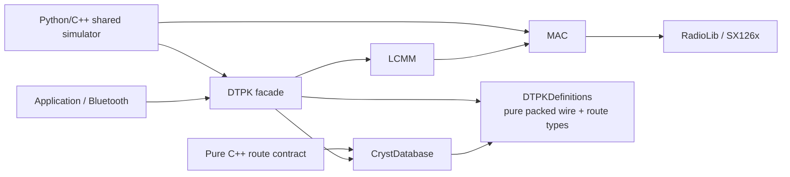
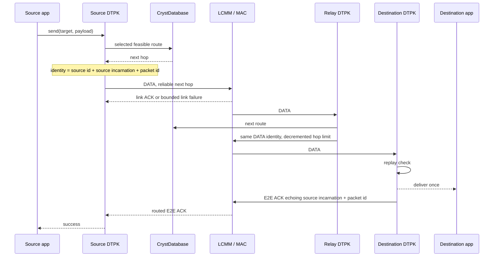
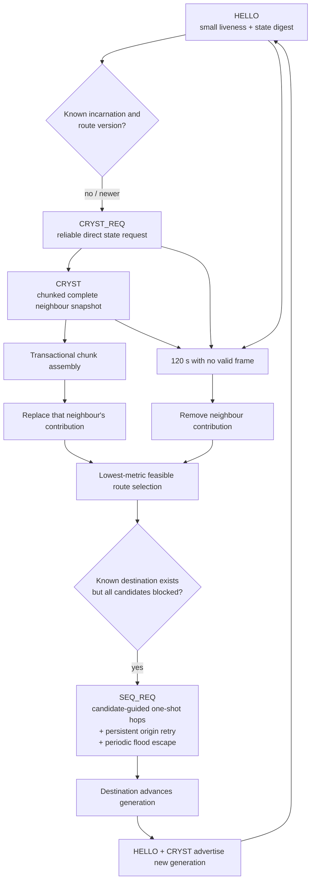
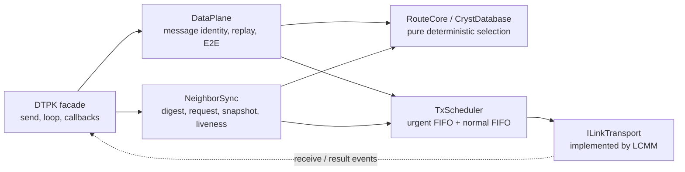

# DTProtocol v4 architecture and simplification review

This document describes the protocol as a set of responsibilities and state
machines rather than as the current source-file layout. It also records which
parts are essential, which have already been removed, and which wire-format
simplifications still need stronger proof.

## The protocol from far away

DTProtocol v4 performs two distinct jobs:

1. **Reliable routed message delivery** over an unreliable half-duplex LoRa
   link.
2. **Self-stabilizing route-state synchronization** after loss, reboot,
   partitions, movement and topology changes.

The current implementation is easiest to understand as five cooperating state
machines:



This is more useful than treating `DTPK`, `LCMM` and `MAC` as one combined
protocol. Each layer has a different definition of success:

| Layer | Success means |
|---|---|
| MAC | One radio frame was started/completed according to channel policy. |
| LCMM | One next hop received the frame and returned its link ACK. |
| DTPK data plane | The final destination accepted the logical message and returned an E2E ACK. |
| Route synchronization | All surviving neighbour snapshots/generations eventually produce feasible routes. |

## Code dependency graph

After the 2026-08 simplification pass, the routing core no longer depends on
Arduino, MAC, LCMM or RadioLib:



Previously the dependency was effectively:

```text
CrystDatabase -> DTPKDefinitions -> LCMM -> MAC -> RadioLib -> Arduino
```

That coupling existed only because receive-overlay structs embedded the LCMM and
MAC prefixes in `DTPKDefinitions.h`. DTPK now receives an LCMM-owned frame and
passes only `frame->data` plus the DTPK payload size to its parsers. The route
database contract therefore compiles as ordinary host C++ with only `-Iinclude`.

## Data-plane flow



The three-part replay identity is necessary. A real MCU reboot resets its
volatile packet counter. The old `{source id, packet id}` key could therefore
silently suppress the first new message that reused an old ID, while still
sending a success ACK. The current key is:

```text
{ original sender, sender incarnation / origin sequence, packet id }
```

ACK and NACK frames echo the same incarnation, so a delayed response from a
previous boot cannot complete a new waiter with the same packet ID.

## Multipart data plane

Large application messages remain one DTPK identity while being carried by a
sequence of 230-byte fragments. Per-hop LCMM reliability protects each fragment;
a destination bitmap and one final E2E ACK provide selective message-level
repair. Fragmentation therefore does not create one independent E2E transaction
per piece and does not expose partial data to the application. See
[`../MULTIPART_PROTOCOL.md`](../MULTIPART_PROTOCOL.md).

## Control-plane flow

The four control messages have separate jobs and should not be collapsed merely
because they all carry routing information:



Important distinctions:

- **HELLO is a digest, not a full refresh.** It keeps stable-network airtime
  small and tells a neighbour when it needs a snapshot.
- **CRYST_REQ is repair plus positive liveness evidence.** A successful link ACK
  refreshes liveness. Failure is only suspicion, never authoritative topology
  withdrawal.
- **CRYST is a transactional full snapshot.** Partial chunks must not mutate the
  route database.
- **SEQ_REQ is the liveness counterpart of feasibility.** Feasibility can safely
  reject a longer same-generation route; the destination must then originate a
  newer generation. A repair wave follows a candidate-guided path and is sent
  once at each hop. The requester owns persistent 5–60 second exponential retry,
  and every fourth attempt floods to escape stale candidate cycles. This avoids
  multiplying one logical repair by five LCMM retries at every hop while keeping
  recovery self-stabilizing until fresh state is learned or all knowledge of the
  destination disappears.

## State ownership

| State | Correct owner | Notes |
|---|---|---|
| Radio mode, IRQ, CCA, carrier/duty deadline | MAC | Must not leak into routing decisions. |
| One-hop packet, retry budget, link ACK timer | LCMM | Exactly one active link transaction today. |
| Per-neighbour last-heard time, digest and chunk assembly | Neighbour synchronization | These are currently several maps and should become one map. |
| Candidate routes by neighbour, feasible distance, selected route | `CrystDatabase` | Pure deterministic routing core. |
| Application replay cache and E2E waiters | DTPK data plane | Identity includes sender incarnation. |
| Urgent/normal outgoing work | TX scheduler | Current vector-based queue should become two FIFO queues. |

## What has already been safely pruned

The following changes do not alter DTPK wire bytes, except for the separately
listed replay-incarnation reliability fix:

| Change | Result |
|---|---|
| Removed abandoned `DTP.h.unused` predecessor | 227 obsolete lines deleted. |
| Removed unused LCMM negotiation/large-packet API, empty handlers and ping bookkeeping | Smaller public surface and LCMM object. |
| Removed legacy crystallization-session state and dead DTPK fields | `KLimit` remains only as a source-compatible ignored argument. |
| Simplified selected `RoutingRecord` | 10 bytes to 6 bytes per selected route, a 40% reduction. |
| Replaced duplicate booleans with derived state | No separate `_waitingForAck` / `_currentlySendingId`; outstanding work is derived from wait records. |
| Replaced `CrystTimeout {bool,int32}` with one signed deadline | One state variable instead of two synchronized fields. |
| Removed transport receive-overlay structs | Pure routing types no longer include LCMM/MAC/RadioLib. |
| Used node ID zero as the empty replay-ring marker | Removed per-entry validity flags; zero is already reserved for broadcast. |

Measured host-layout changes during this pass:

- `RoutingRecord`: **10 -> 6 bytes**.
- `LCMM`: **80 -> 72 bytes**.
- `DTPK`: **1808 -> 1656 bytes**, despite adding reboot-safe replay
  incarnations.
- The first dead-code pass alone removed **326 source lines**; the transport
  decoupling removed another **68 net lines**.

## Reliability findings from the architecture review

### 1. Freshness gates feasibility; it is not a route metric

A destination generation determines whether a candidate may safely be used.
Once candidates pass that feasibility predicate, ordinary metric selection must
choose the shortest route. Preferring a newer generation merely because it is
newer can keep a longer path selected or oscillate between fresh announcements.
Repair therefore requests newer state only when feasibility blocks every known
candidate; forwarding still selects the lowest-metric feasible candidate.

### 2. Failed probes cannot prove death

Two lost probes caused stable large networks to withdraw healthy neighbours.
Probe success is positive evidence; topology changes only after the hard
no-valid-frame timeout.

### 3. Replay identity must survive reboot

The old two-field replay key caused reproducible silent message loss after
reboot. Source incarnation is now carried by DATA/ACK/NACK and included in replay
and waiter identity.

### 4. A finite repair burst is not self-stabilizing

A deterministic six-node, 5% loss trace remained permanently missing a reachable
route after all five sequence-request attempts were lost or failed to reach the
necessary origin. Repair now persists with 5, 10, 20, 40 and then 60 second
backoff until convergence, and stops when the destination is no longer known.
The same trace now converges by 500 seconds.

## Remaining simplification opportunities

### A. Safe internal simplifications

These should be done before another wire redesign.

#### One `NeighborSyncState` map

Four maps currently share the same neighbour key:

```text
_lastHeard
_lastLivenessProbe
_neighborState
_crystAssemblies
```

They should become:

```cpp
struct NeighborSyncState {
    uint32_t lastHeard;
    uint32_t lastProbe;
    uint16_t originSequence;
    uint32_t routeVersion;
    CrystAssembly assembly;
};
```

Benefits: one lookup path, one removal path, fewer opportunities to forget to
clear related state after expiry/reincarnation, and a clearer ownership boundary.
The assembly may be optional/lazy to avoid allocating vectors for every
neighbour.

#### Two FIFO TX queues

Urgent control currently uses `vector.insert(begin, ...)`, which is O(n), reverses
relative order and can starve normal work during a repair storm. Use:

```text
urgent FIFO: ACK, NACK, CRYST_REQ, SEQ_REQ
normal FIFO: DATA, HELLO, CRYST
```

The scheduler always drains urgent first but preserves FIFO within each class.
A small fairness quota can prevent permanent data starvation.

#### Flat bounded CRYST assembly

`vector<vector<NeighborRecordV2>>` with a maximum of 256 chunks is flexible but
fragmentation-heavy for an MCU. Prefer one flat record buffer plus a received
chunk bitmap and explicit limits derived from available RAM. Reject a snapshot
whose declared allocation exceeds the configured bound before allocating.

#### Separate message and control counters

One counter currently supplies DATA identities and disposable control IDs.
Reboot safety is fixed by the source incarnation, but separate counters would
make traces, wrap analysis and API semantics clearer.

### B. Promising wire simplifications requiring a v2.x version boundary

#### Remove unused IDs from digest/snapshot/request control packets

DTPK assigns a 16-bit ID to HELLO, CRYST and CRYST_REQ, but none of their receive
paths uses it. LCMM already provides a link-transaction ID where required.
Removing those fields would save two bytes from every such control frame:

| Packet | Current DTPK bytes | Candidate |
|---|---:|---:|
| HELLO | 9 | 7 |
| CRYST header | 13 | 11 |
| CRYST_REQ | 3 | 1 |

This is a straightforward change, but it is wire-incompatible and therefore
belongs behind an explicit protocol version transition.

#### Five-byte feasibility-only route record

The v4 wire format removes `NeighborRecordV2.from`. That field existed only
for split horizon; feasibility remains the route-loop safety invariant. Each
advertised route therefore changes from **7 to 5 bytes**:

- records per 255-byte frame: **33 -> 46**;
- modeled 100-route snapshot: approximately **796 -> 566 radio bytes**;
- reduction: approximately **29%**.

Pre-change evidence without split horizon included:

- 351 exhaustive lossless initial/cut/heal cases through four nodes;
- all **728 connected five-node graphs**, covering **9,008** deterministic
  initial/cut/heal cases;
- 500 random 5-10 node cases with 0-15% loss, cut and heal;
- no observed routing loop or final convergence failure.

Those results are evidence, not a proof, and must be rerun after each repair or
chunking change. The critical property is not merely “no loop observed”; every
accepted same-generation successor must satisfy the feasibility condition under
every relevant message ordering. The bounded optimization/model-checking work
therefore remains part of the acceptance gate for this wire change.

### C. Do not prune these

| Mechanism | Why it remains necessary |
|---|---|
| Per-hop LCMM ACK/retry | Prevents one unreliable relay hop from dominating multi-hop delivery probability. |
| E2E ACK/NACK | Distinguishes final acceptance from merely reaching the next hop. |
| Replay suppression | Required because link and E2E reliability intentionally create duplicates. |
| Sender incarnation | Prevents rebooted traffic from colliding with old replay entries and delayed ACKs. |
| Hop limit | Last-resort forwarding bound even if route state is temporarily inconsistent. |
| HELLO digest | Cheap liveness and missed-state detection without periodic full vectors. |
| CRYST_REQ + full snapshot | Repairs lost event-triggered state transactionally. |
| Destination generation + feasibility | Provides loop safety during route worsening/withdrawal. |
| Persistent SEQ_REQ | Restores liveness when feasibility rejects all known candidates. |
| Hard inactivity timeout | Eventually removes truly vanished neighbours without treating packet loss as proof. |

## Recommended target code shape

The public `DTPK` singleton can remain temporarily, but its internals should move
toward four explicit components:



Each component should expose event-style methods rather than inspect another
layer's internals:

```text
DataPlane:    sendApp(), onData(), onE2EAck(), onTimeout()
NeighborSync: onHello(), onSnapshotChunk(), onStateRequest(), onTimer()
RouteCore:    replaceContribution(), removeNeighbor(), select(), blockedRepairs()
TxScheduler:  enqueueUrgent(), enqueueNormal(), onLinkReady(), onLinkResult()
```

This makes the protocol easier to model-check because every transition has an
explicit input and one state owner.

## Recommended order of further work

1. Commit the current replay-incarnation and persistent-repair reliability
   changes as hard regression gates.
2. Merge per-neighbour synchronization state into one owner.
3. Replace the vector priority queue with two FIFO queues and add starvation
   tests.
4. Add a bounded flat snapshot assembler and malformed-size tests.
5. Write a small exhaustive/formal model with split horizon disabled.
6. Only if that proof/test matrix passes, remove `NeighborRecordV2.from` in a
   versioned wire update together with the unused control IDs.
7. Consider delta snapshots only after the full-state design is simple and
   proven; deltas save airtime but add ordering, loss-repair and tombstone state.

## Validation gate

Every simplification should preserve all of the following:

- no forwarding loops at any sampled intermediate state;
- eventual removal of unreachable destinations;
- eventual recovery of every reachable destination under bounded loss;
- exactly-once application delivery despite link retries and sender reboot;
- no false success from a stale ACK/NACK incarnation;
- normal and ASan/UBSan native contracts;
- Python and real-C++ differential scenarios using the same environment trace.
